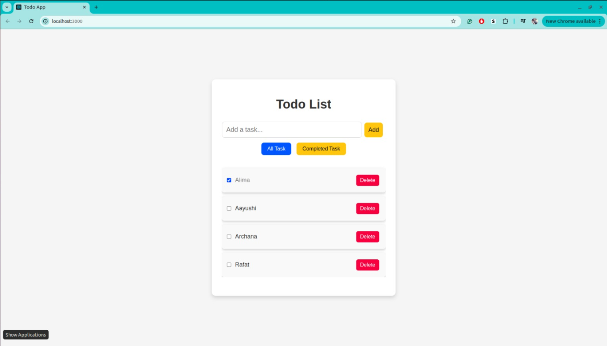

✨ Todo App

This is a sleek and efficient Todo App built with React. It allows users to manage tasks effortlessly while ensuring data persistence using LocalStorage.

🚀 Features

✅ Add new tasks

✅ Mark tasks as completed

🗑️ Delete tasks

🔍 Filter tasks (All & Completed)

💾 Data persistence with LocalStorage

🛠️ Installation

Clone the Repository:

 git clone git@github.com:alimausmani/todo-task.git

Navigate to the Project Folder:

cd todo-task

Install Dependencies:

npm install

Start the Development Server:

npm start

Your app will be available at http://localhost:3000 🎉

🏗️ Technologies Used

⚛️ React

🎨 CSS (Flexbox for layout)

🌐 JavaScript (ES6+)

💾 LocalStorage for data persistence

📂 Folder Structure

/ todo-task
  ├── /public
  ├── /src
      ├── /components
      ├── App.js
      ├── index.js
      ├── App.css
  ├── package.json
  ├── README.md

🚀 Deployment

To deploy the app, build the production files and host them on a platform like Vercel or Netlify.

npm run build

📜 License

This project is open-source and available under the MIT License.

Happy Coding! 🎉

